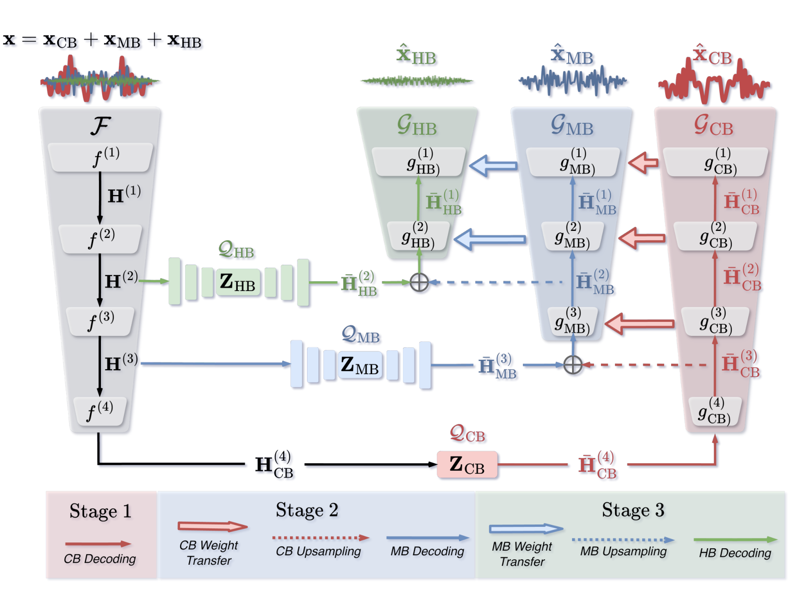
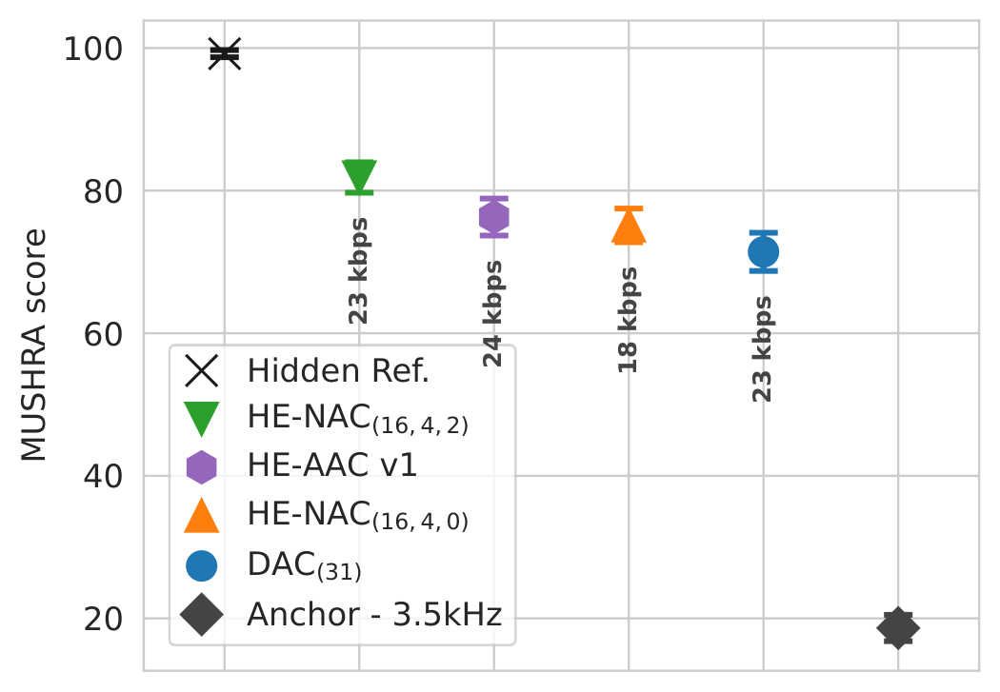

# HE-NAC 🎧

[](https://doi.org/10.1109/TASLPRO.2026.3739174)
[](https://huggingface.co/darius522/henac)
[](LICENSE)

**Hierarchical and residual multi-band neural audio coding at 32 kHz.** HE-NAC
builds on [DAC](https://github.com/descriptinc/descript-audio-codec) and learns
three paths in sequence: train the core, freeze it while training the mid band,
then freeze both while training the high band. This repository provides one
implementation for all three stages, plus inference and objective evaluation.



*The three-stage HE-NAC architecture. Figure from the
[paper](https://doi.org/10.1109/TASLPRO.2026.3739174).*

| Stage | Trainable path | Loss target | Starts from |
| --- | --- | --- | --- |
| Core | Encoder, core RVQ, blind decoder | Full band | Scratch |
| Mid | Mid skip RVQ and decoder | Above 3 kHz | Core checkpoint |
| High | High skip RVQ and decoder | Above 6 kHz | Mid checkpoint |

The stage handoff copies the trained decoder tail into the next path, matching
the original branch-based implementation. At inference, band-filtered decoder
outputs are summed to produce the waveform.

## Quick start 🚀

Use Python 3.10 or newer. Install PyTorch for your platform, then install
HE-NAC from a source checkout:

```bash
python -m pip install -e .
```

The [300k checkpoint](https://huggingface.co/darius522/henac) is distributed
separately under the **MIT license**. While its model repository is private,
Hugging Face access is required. Install the `hf` CLI if needed, then download
it from the checkout root:

```bash
python -m pip install -U huggingface_hub
hf auth login  # only needed while the model repository is private
hf download darius522/henac henac-300k.pth --local-dir checkpoints
```

The checkpoint's SHA-256 is
`978c7e9950b787b7a3673c198678c711cd5fab2fe766f4e41516125fc35a305e`.
It embeds its model configuration; no separate YAML file is needed for
inference.

Reconstruct a WAV or FLAC file, or a directory of them:

```bash
henac-infer --checkpoint checkpoints/henac-300k.pth \
  --input path/to/input_dir --output outputs \
  --codebooks 16 4 2
```

Outputs are 32 kHz PCM WAVs. Stereo and other multichannel inputs are averaged
to mono for coding, then the reconstruction is copied back to the original
channel count. Longer files are processed in chunks with context; adjust
`--chunk-seconds` and `--context-seconds` if needed. A core path is required,
and a high path also requires a mid path.

> **Bitrate note:** `entropy.csv` reports empirical Shannon entropy estimates
> from the observed code indices. It is not an encoded file size. HE-NAC does
> not currently write an entropy-coded bitstream; the paper's effective
> bitrates were measured after Huffman coding.

## Listen and results 🎧

The paper's MUSHRA-style test used 12 ten-second FMA excerpts at 32 kHz and
15 expert listeners after screening. Each trial included a hidden reference,
a 3.5 kHz low-pass anchor, and four coded systems. The 23 kbps HE-NAC setting
had the highest mean score among the coded systems.



[▶ Listen to six side-by-side audio comparisons](https://www.dariuspetermann.com/henac/)

## Train 🏋️

Provide separate training and validation WAV/FLAC directories, individual
files, or CSV manifests with a `path` column. The recipes in `conf/henac/`
contain the reference architecture and loss settings. From the checkout root:

```bash
CUDA_VISIBLE_DEVICES=0 henac-train --args.load conf/henac/core.yml \
  --train_path /data/train --val_path /data/valid --save_path runs/core

CUDA_VISIBLE_DEVICES=0 henac-train --args.load conf/henac/mid.yml \
  --init_from runs/core/best.pth \
  --train_path /data/train --val_path /data/valid --save_path runs/mid

CUDA_VISIBLE_DEVICES=0 henac-train --args.load conf/henac/high.yml \
  --init_from runs/mid/best.pth \
  --train_path /data/train --val_path /data/valid --save_path runs/high
```

For multi-GPU training, use `torchrun`, for example:

```bash
torchrun --nproc_per_node=8 -m henac.train \
  --args.load conf/henac/core.yml \
  --train_path /data/train --val_path /data/valid --save_path runs/core
```

- `best.pth` contains model weights; `latest.pth` also contains the optimizer
  and scheduler for `--resume_from runs/<stage>/latest.pth`. `--init_from`
  starts the next stage with a fresh optimizer and discriminator.
- `--num_iters` is the total desired optimizer step count, including completed
  steps. Resume restores the data offset, but not random number generator
  state, so it is not a bit-exact continuation.
- The paper reports 300k steps with effective batch size 32. The historical
  high-band config saved with the 300k checkpoint has a 400k-step schedule and
  batch size 8 per process. Use `--num_iters 300000` to stop these recipes at
  300k; four processes at batch size 8 give effective batch size 32.
- The original training corpus is not included. Multiple balanced source
  groups can be set through `train/build_dataset.folders` and
  `val/build_dataset.folders` in a recipe.

Training has no explicit entropy-control loss. The lower entropy of the
higher-band codes is an empirical result of the staged residual design.

## Evaluate 📊

```bash
henac-eval --reference path/to/input_dir --reconstruction outputs
```

The evaluator matches relative filenames and writes per-file full-band and
band-wise L1, SNR, and SI-SDR to `evaluation.csv`, with means in
`evaluation.json`.

## Citation 📄

If HE-NAC helps your work, please cite the [paper](https://doi.org/10.1109/TASLPRO.2026.3739174):

```bibtex
@ARTICLE{11718947,
  author={Pétermann, Darius and Lim, Wootaek and Beack, Seungkwon and Kim, Minje},
  journal={IEEE Transactions on Audio, Speech and Language Processing},
  title={HE-NAC: High-Efficiency Neural Audio Coding Via Hierarchical and Residual Multi-Band Quantization},
  year={2026},
  volume={},
  number={},
  pages={1-15},
  keywords={Modeling;Codes;Bit rate;Speech;Encoding;Audio coding;High frequency;Distance measurement;Frequency;Decoding;Neural audio coding;high-efficiency;multiband;residual},
  doi={10.1109/TASLPRO.2026.3739174}}
```

The [project page](https://minjekim.com/research-projects/he-nac) has more
information. Machine-readable citation data is in [CITATION.cff](CITATION.cff).
Code and released checkpoint weights are under the MIT license; code adapted
from DAC retains its attribution in [LICENSE](LICENSE).
